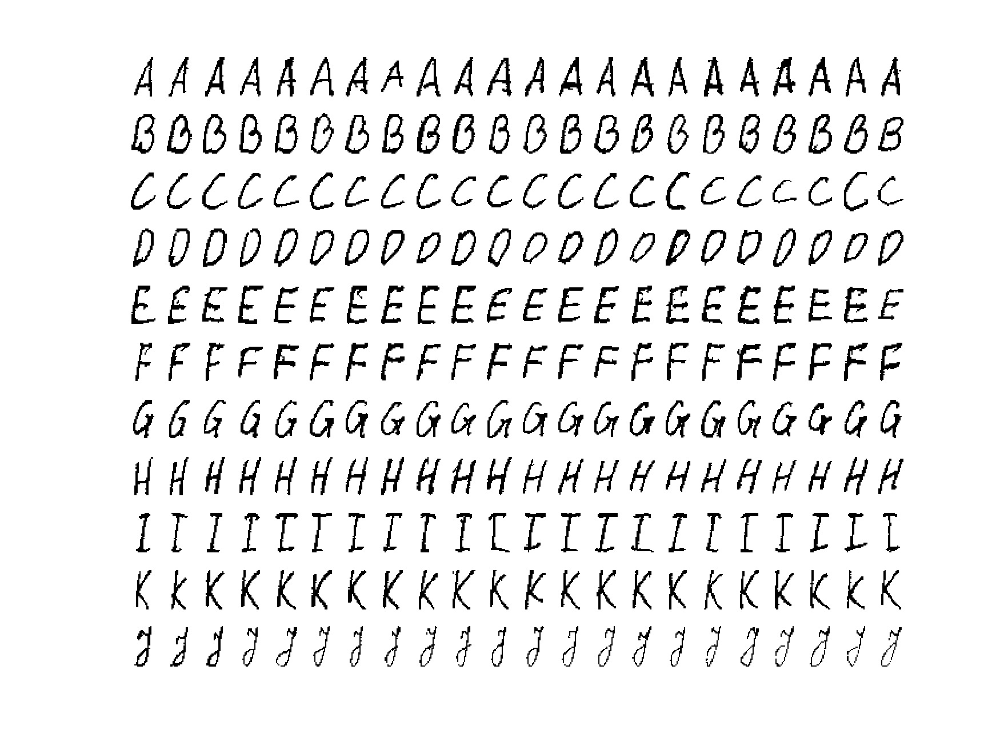
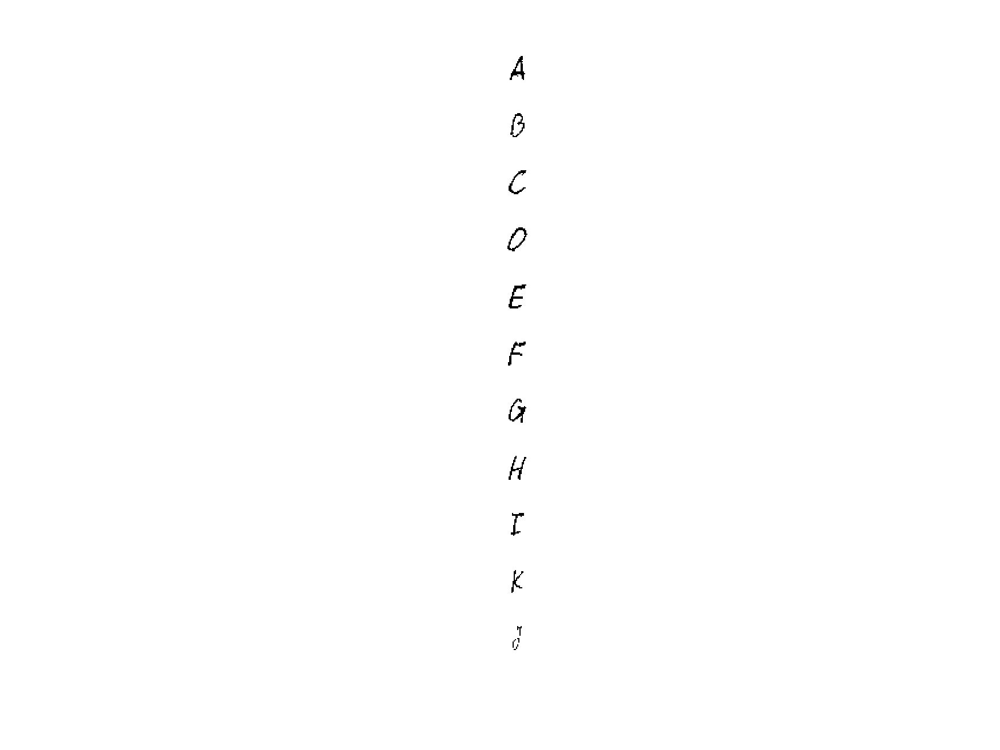
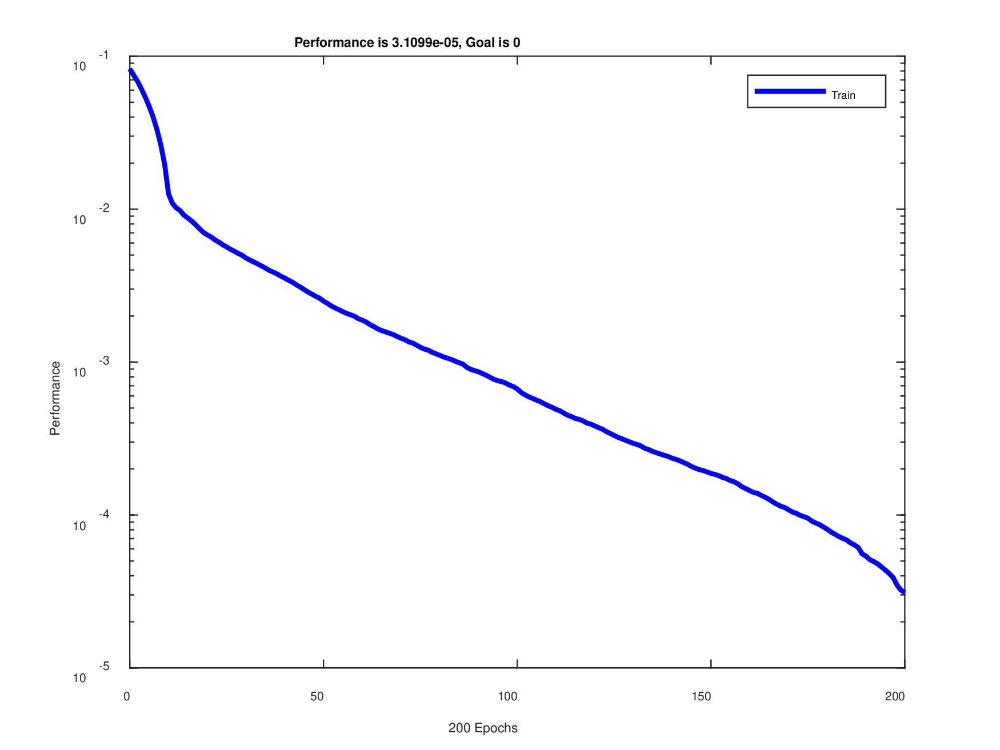

# Prepare data set for training and target vector

```matlab:Code
train_set_name = 'train_data.jpg';
train_features = pozymiai_raidems_atpazinti(train_set_name, 11);
```





```matlab:Code
train_feat_matr = cell2mat(train_features);
pavadinimas = 'first_test.jpg';
first_test_features = pozymiai_raidems_atpazinti(pavadinimas, 11);
```





```matlab:Code
first_test_matr = cell2mat(first_test_features);
pavadinimas = 'test_data.jpg';
pozymiai_patikrai = pozymiai_raidems_atpazinti(pavadinimas, 1);
```


```matlab:Code
main_test_matr = cell2mat(pozymiai_patikrai);
```


```matlab:Code
T = {[ones(1, 22); zeros(10, 22)], ...
    [zeros(1, 22); ones(1, 22); zeros(9, 22)], ...
    [zeros(2, 22); ones(1, 22); zeros(8, 22)], ...
    [zeros(3, 22); ones(1, 22); zeros(7, 22)], ...
    [zeros(4, 22); ones(1, 22); zeros(6, 22)], ...
    [zeros(5, 22); ones(1, 22); zeros(5, 22)], ...
    [zeros(6, 22); ones(1, 22); zeros(4, 22)], ...
    [zeros(7, 22); ones(1, 22); zeros(3, 22)], ...
    [zeros(8, 22); ones(1, 22); zeros(2, 22)], ...
    [zeros(9, 22); ones(1, 22); zeros(1, 22)], ...
    [zeros(10, 22); ones(1, 22)]};
```

# Create and test network with 13 neurons

```matlab:Code
tinklas = newrb(train_feat_matr,T,0,1,13);
```


```text:Output
NEWRB, neurons = 0, MSE = 0.0826446
```


```matlab:Code
atsakymas = recognize(tinklas, first_test_matr);
disp(atsakymas)
```


```text:Output
ABCDEFGHIKJ
```


```matlab:Code
atsakymas = recognize(tinklas, main_test_matr);
disp(atsakymas)
```


```text:Output
HIJACAED
```

# Network with 5 neurons

```matlab:Code
tinklas5 = newrb(train_feat_matr,T,0,1,5);
```


```text:Output
NEWRB, neurons = 0, MSE = 0.0826446
```


```matlab:Code
atsakymas = recognize(tinklas5, first_test_matr);
disp(atsakymas)
```


```text:Output
ABCDCAAAIKA
```


```matlab:Code
atsakymas = recognize(tinklas5, main_test_matr);
disp(atsakymas)
```


```text:Output
AIAACACD
```

# Network with automatic neurons

```matlab:Code
tinklasinf = newrb(train_feat_matr,T,0,1);
```


```text:Output
NEWRB, neurons = 0, MSE = 0.0826446
NEWRB, neurons = 50, MSE = 0.00250204
NEWRB, neurons = 100, MSE = 0.000666438
NEWRB, neurons = 150, MSE = 0.000187091
NEWRB, neurons = 200, MSE = 3.1099e-05
```





```matlab:Code
atsakymas = recognize(tinklasinf, first_test_matr);
disp(atsakymas)
```


```text:Output
ABCDEFGHIKJ
```


```matlab:Code
atsakymas = recognize(tinklasinf, main_test_matr);
disp(atsakymas)
```


```text:Output
HIJACCED
```

  

```matlab:Code
function atsakymas = recognize(network, features)
    Y2 = sim(network, features);
    [a2, b2] = max(Y2);
    raidziu_sk = size(features,2);
    atsakymas = zeros(raidziu_sk, 1);
    for k = 1:raidziu_sk
        switch b2(k)
            case 1
                atsakymas(k) = 'A';
            case 2
                atsakymas(k) = 'B';
            case 3
                atsakymas(k) = 'C';
            case 4
                atsakymas(k) = 'D';
            case 5
                atsakymas(k) = 'E';
            case 6
                atsakymas(k) = 'F';
            case 7
                atsakymas(k) = 'G';
            case 8
                atsakymas(k) = 'H';
            case 9
                atsakymas(k) = 'I';
            case 10
                atsakymas(k) = 'K';
            case 11
                atsakymas(k) = 'J';
        end
    end
    atsakymas = char(atsakymas)';
end
```

